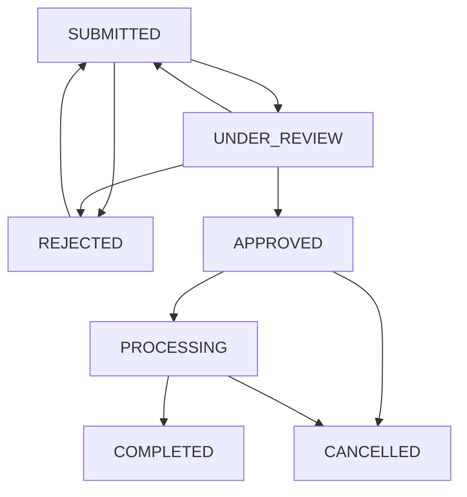

# OEM EV Warranty Management System

Hệ thống quản lý bảo hành xe điện được xây dựng bằng PHP Laravel với Docker.

## 🚀 Tính năng chính

- **Form tạo warranty claim** với validation đầy đủ
- **Workflow quản lý trạng thái** với 7 trạng thái
- **API REST** cho tích hợp với hệ thống khác
- **Web interface** responsive với Alpine.js
- **Docker containerization** để dễ dàng triển khai

## 🛠️ Công nghệ sử dụng

- **Backend**: PHP 8.2, Laravel 10
- **Database**: MySQL 8.0
- **Web Server**: Nginx
- **Frontend**: Blade Templates, Alpine.js, Tailwind CSS
- **Container**: Docker & Docker Compose

## 🏗️ Kiến trúc hệ thống

```
src/
├── components/           # React components
│   ├── CreateWarrantyClaimForm.tsx
│   └── WarrantyClaimsList.tsx
├── models/              # TypeScript types & interfaces
│   └── warranty-claim.types.ts
├── services/            # Business logic
│   └── warranty.service.ts
├── utils/               # Utilities & helpers
│   └── warranty-workflow.ts
├── App.tsx             # Main app component
├── main.tsx            # App entry point
└── index.css           # Tailwind CSS styles
```

## 🛠️ Cài đặt và chạy

### Yêu cầu hệ thống
- Node.js 18+
- npm hoặc yarn

### Cài đặt dependencies
```bash
npm install
```

### Chạy development server
```bash
npm run dev
```

Ứng dụng sẽ chạy tại `http://localhost:3000`

### Build production
```bash
npm run build
```

## 📋 Dependencies chính

```json
{
  "react": "^18.2.0",
  "react-dom": "^18.2.0", 
  "typescript": "^5.2.2",
  "vite": "^5.0.8",
  "tailwindcss": "^3.3.6"
}
```

## 🎯 Cách sử dụng

### 1. Tạo warranty claim mới
1. Click vào tab "Tạo mới"
2. Điền thông tin khách hàng và sản phẩm
3. Chọn loại sự cố và mức độ ưu tiên
4. Nhập tiêu đề và mô tả chi tiết
5. Đính kèm file nếu cần
6. Submit form

### 2. Quản lý claims
1. Click vào tab "Danh sách"
2. Sử dụng bộ lọc để tìm claims
3. Click vào actions để thay đổi trạng thái
4. Nhập lý do nếu được yêu cầu

### 3. Workflow trạng thái



## 🔧 Tùy chỉnh

### Thêm trạng thái mới
1. Cập nhật `ClaimStatus` enum trong `warranty-claim.types.ts`
2. Thêm transitions trong `warranty-workflow.ts`
3. Cập nhật display names và colors

### Thêm loại sự cố
1. Cập nhật `ClaimType` enum
2. Thêm display names trong components

### Thêm quyền người dùng
1. Cập nhật `allowedRoles` trong transitions
2. Implement authentication service

## 🧪 Testing

### Mock data
Service đã tích hợp mock data để test:
```typescript
await warrantyService.generateMockData();
```

### Test cases
- Form validation
- State transitions
- Filters và search
- File upload

## 📱 Responsive Design

Interface được thiết kế responsive với Tailwind CSS:
- Mobile-first approach
- Grid system linh hoạt
- Touch-friendly buttons

## 🔒 Bảo mật

- Input validation ở cả client và server
- File upload restrictions
- Role-based access control
- XSS protection

## 🚀 Roadmap

- [ ] Authentication & Authorization
- [ ] Real-time notifications
- [ ] Email integration  
- [ ] Mobile app
- [ ] Advanced reporting
- [ ] API documentation
- [ ] Unit tests
- [ ] Docker deployment

## 🤝 Đóng góp

1. Fork repository
2. Tạo feature branch
3. Commit changes
4. Push to branch
5. Tạo Pull Request

## 📄 License

MIT License - xem [LICENSE](LICENSE) để biết thêm chi tiết.

## 📞 Liên hệ

- Email: support@warranty-system.com
- Documentation: [Wiki](https://github.com/warranty-system/wiki)
- Issues: [GitHub Issues](https://github.com/warranty-system/issues)