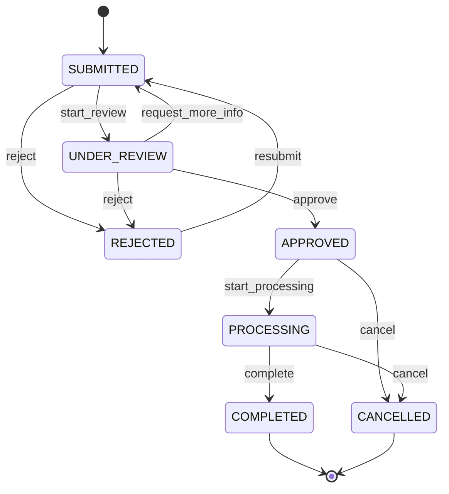

# Warranty Claim Workflow Documentation

## Tổng quan Workflow

Hệ thống quản lý warranty claim sử dụng state machine để đảm bảo quá trình xử lý tuân thủ đúng quy trình và có thể theo dõi được.

## State Diagram



## Chi tiết các trạng thái

### 1. SUBMITTED (Đã gửi)
- **Mô tả**: Trạng thái ban đầu khi khách hàng tạo yêu cầu bảo hành
- **Người thực hiện**: Customer, System
- **Thời gian**: Ngay lập tức khi submit form
- **Next steps**: Chờ được xem xét bởi reviewer

### 2. UNDER_REVIEW (Đang xem xét)
- **Mô tả**: Đang được đội ngũ kỹ thuật xem xét và đánh giá
- **Người thực hiện**: Reviewer, Admin
- **Thời gian**: 1-3 ngày làm việc
- **Activities**: 
  - Kiểm tra thông tin khách hàng và sản phẩm
  - Đánh giá tính hợp lệ của claim
  - Yêu cầu thêm thông tin nếu cần

### 3. APPROVED (Đã phê duyệt)
- **Mô tả**: Yêu cầu được xác nhận hợp lệ và được phê duyệt
- **Người thực hiện**: Reviewer, Admin
- **Thời gian**: Sau khi xem xét xong
- **Next steps**: Chuẩn bị bắt đầu quá trình xử lý

### 4. REJECTED (Bị từ chối)
- **Mô tả**: Yêu cầu không đáp ứng điều kiện bảo hành
- **Người thực hiện**: Reviewer, Admin
- **Lý do từ chối**:
  - Hết hạn bảo hành
  - Không thuộc phạm vi bảo hành
  - Thông tin không đầy đủ
  - Hư hỏng do người dùng

### 5. PROCESSING (Đang xử lý)
- **Mô tả**: Đang thực hiện sửa chữa hoặc thay thế
- **Người thực hiện**: Technician, Service Center
- **Activities**:
  - Lên lịch sửa chữa
  - Đặt hàng phụ tùng
  - Thực hiện sửa chữa
  - Test và quality check

### 6. COMPLETED (Hoàn thành)
- **Mô tả**: Đã hoàn thành xử lý thành công
- **Người thực hiện**: Technician, Admin
- **Deliverables**:
  - Sản phẩm được sửa chữa
  - Báo cáo kỹ thuật
  - Xác nhận từ khách hàng

### 7. CANCELLED (Đã hủy)
- **Mô tả**: Yêu cầu bị hủy bởi khách hàng hoặc hệ thống
- **Lý do hủy**:
  - Khách hàng không muốn tiếp tục
  - Không thể sửa chữa được
  - Chi phí quá cao

## Quy tắc chuyển trạng thái

### Actions và Transitions

| From State | Action | To State | Required Role | Requires Reason |
|------------|--------|----------|---------------|-----------------|
| SUBMITTED | start_review | UNDER_REVIEW | Admin, Reviewer | No |
| SUBMITTED | reject | REJECTED | Admin, Reviewer | Yes |
| UNDER_REVIEW | approve | APPROVED | Admin, Reviewer | No |
| UNDER_REVIEW | reject | REJECTED | Admin, Reviewer | Yes |
| UNDER_REVIEW | request_more_info | SUBMITTED | Admin, Reviewer | Yes |
| APPROVED | start_processing | PROCESSING | Admin, Technician | No |
| APPROVED | cancel | CANCELLED | Admin | Yes |
| PROCESSING | complete | COMPLETED | Admin, Technician | No |
| PROCESSING | cancel | CANCELLED | Admin | Yes |
| REJECTED | resubmit | SUBMITTED | Customer | No |

### Business Rules

1. **Time Limits**:
   - SUBMITTED → UNDER_REVIEW: Trong 24h
   - UNDER_REVIEW → APPROVED/REJECTED: Trong 72h
   - APPROVED → PROCESSING: Trong 7 ngày
   - PROCESSING → COMPLETED: Tùy thuộc loại sự cố

2. **Priority Handling**:
   - CRITICAL: Xử lý trong 1 ngày
   - HIGH: Xử lý trong 3 ngày
   - MEDIUM: Xử lý trong 1 tuần
   - LOW: Xử lý trong 2 tuần

3. **Auto-transitions**:
   - Auto-reject sau 30 ngày không có thông tin
   - Auto-complete sau test thành công
   - Auto-cancel nếu khách hàng không phản hồi

## Role-based Access Control

### Admin
- Toàn quyền trên tất cả claims
- Có thể thực hiện mọi action
- Quản lý workflow rules

### Reviewer  
- Xem xét và phê duyệt claims
- Yêu cầu thêm thông tin
- Từ chối claims không hợp lệ

### Technician
- Bắt đầu và hoàn thành processing
- Cập nhật tiến độ sửa chữa
- Báo cáo kỹ thuật

### Customer
- Tạo claims mới
- Resubmit claims bị reject
- Xem trạng thái claims của mình

## Integration Points

### External Systems
- **CRM**: Đồng bộ thông tin khách hàng
- **Inventory**: Kiểm tra phụ tùng
- **Service Centers**: Lên lịch sửa chữa
- **Notification**: Email/SMS updates

### API Endpoints
```typescript
POST /api/claims - Tạo claim mới
GET /api/claims/:id - Lấy thông tin claim
PUT /api/claims/:id/status - Cập nhật trạng thái
GET /api/claims - Lấy danh sách claims với filter
```

## Monitoring và Metrics

### KPIs theo dõi
- **Time to First Review**: Thời gian từ submit đến review
- **Approval Rate**: Tỷ lệ phê duyệt
- **Resolution Time**: Thời gian xử lý trung bình
- **Customer Satisfaction**: Đánh giá từ khách hàng

### Alerts
- Claims quá hạn xử lý
- Tỷ lệ reject cao bất thường
- Backlog quá nhiều ở một trạng thái

## Error Handling

### Validation Errors
- Invalid state transitions
- Missing required information
- Permission denied

### Recovery Strategies
- Rollback to previous state
- Manual intervention required
- Escalation to administrator

## Testing Strategy

### Unit Tests
- State transition logic
- Business rule validation
- Permission checks

### Integration Tests
- End-to-end workflow
- External system integration
- Error scenarios

### Load Testing
- Concurrent claim processing
- Peak load handling
- Database performance

---

**Lưu ý**: Workflow này có thể được tùy chỉnh theo yêu cầu cụ thể của từng tổ chức và có thể thêm các trạng thái hoặc quy tắc chuyển đổi mới khi cần thiết.